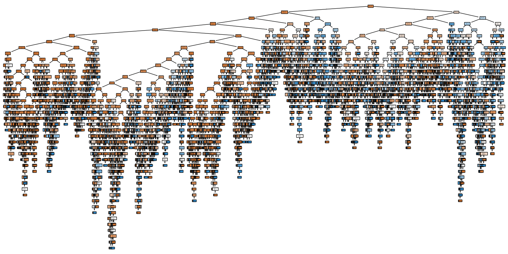

# SCT_DS_3

🧠 Decision Tree Classifier – Bank Marketing Campaign

This project implements a Decision Tree Classifier to predict whether a customer will subscribe to a term deposit product after a marketing campaign. It uses real-world data from the UCI Machine Learning Repository.

  

📌 Task Overview

Task:
Build a machine learning model using the Bank Marketing Dataset to:

    🔍 Predict customer conversion (yes/no) based on demographic and behavioral features using a Decision Tree Classifier.

📁 Dataset: bank-full.csv

The dataset contains marketing campaign data collected via phone calls by a Portuguese banking institution. It includes:

    Demographic data: age, job, marital status, education

    Campaign-related data: contact type, duration, previous outcomes

    Output label: y (yes/no – did the client subscribe?)

📎 Dataset Source: Bank Marketing Dataset – UCI
🛠️ Tools & Libraries
Component	Description
📘 Jupyter Notebook	Interactive development
🐍 Python 3.x	Programming language
📦 pandas, numpy	Data manipulation
📊 matplotlib, seaborn	Data visualization
🧠 sklearn	Machine learning algorithms (Decision Tree Classifier)
🚀 Project Workflow
1. Load & Explore Data

    Check structure and missing values

    Understand class distribution and imbalance

2. Preprocessing

    Encode categorical variables using Label Encoding or One-Hot

    Handle imbalanced data if needed

    Train-test split

3. Model Training

    Fit DecisionTreeClassifier from scikit-learn

    Tune max_depth, criterion, and min_samples_split

4. Evaluation

    Classification report (accuracy, precision, recall)

    Confusion matrix

    Tree depth and node insights

5. Visualization

    Feature importance

    Full decision tree (see image above 👆)

📊 Results

    Decision Tree Accuracy: 📈 ~XX.X% (Update this after evaluating)

    Most influential features: duration, poutcome, contact, etc.

    Deep tree structure as seen in the generated visualization
